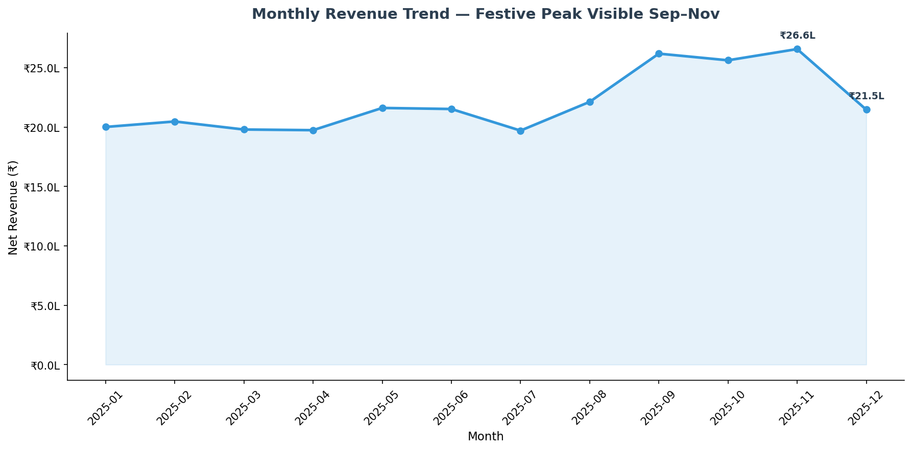
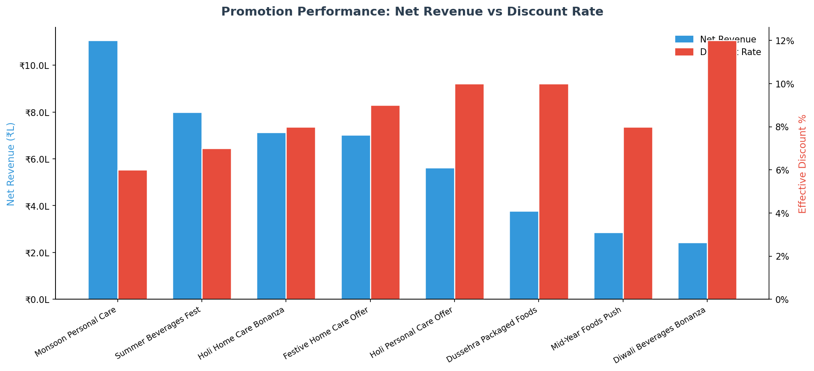
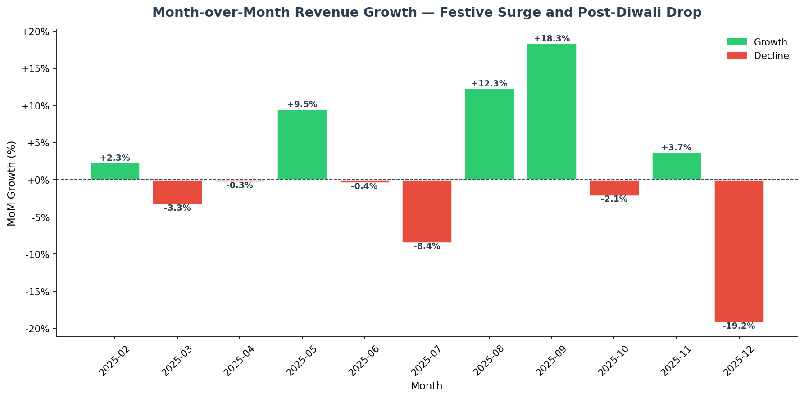

# Route-to-Retail: FMCG Distributor Sales SQL Case Study

A PostgreSQL case study analyzing FMCG distributor performance, product category trends, regional sales patterns, and promotion effectiveness — built on a 7-table schema designed from scratch with 15,000 synthetic but realistic sales transactions.

---

**7 tables · 40 SKUs · ~15K transactions · 20 queries · PostgreSQL on Neon**

---

## Schema

| Table | Description |
|---|---|
| `zones` | 4 Indian sales zones — North, West, South, East |
| `distributors` | 30 distributors across zones, tiered A/B/C by volume |
| `retailers` | 119 retailers across General Trade, Modern Trade, and Wholesale channels |
| `products` | 40 SKUs across 4 FMCG categories with MRP, trade price, and category-specific cost prices |
| `promotions` | 8 promotions clustered around Holi, Summer, and Diwali/Dussehra festive periods |
| `sales_orders` | 3,771 orders placed by retailers |
| `sales_order_items` | 14,997 line items with gross, discount, and net sales values |

---

## Key Design Decisions

**Header/line order model.** Sales are split into `sales_orders` (one row per order) and `sales_order_items` (one row per SKU per order), matching the structure of real ERP systems like SAP. This makes aggregation at both order and line-item level natural, and avoids collapsing transactional detail.

**Category-specific gross margins.** Margins are encoded at the product level to reflect real FMCG economics: Personal Care 34%, Home Care 28%, Packaged Foods 24%, Beverages 22%. Margin analysis queries produce differentiated results rather than uniform outputs.

**Distributor tier drives retailer count.** Tier A distributors serve 6 retailers, Tier B serve 4, Tier C serve 3. This creates realistic volume dispersion and makes underperformance detection meaningful — a Tier C distributor with low revenue is a different signal than a Tier A with the same number.

**Promotion attachment at 20%.** The `promotion_id` column on `sales_order_items` is nullable, with roughly 20% of line items attached to a promotion. Promotion scope is at the category level, not the SKU level, matching how trade promotions typically operate.

**Zone volume weighting.** Order volume is weighted by zone: North 30%, West 28%, South 23%, East 19%. This creates a non-uniform regional distribution that makes zone comparison queries more informative than a flat dataset would.

---

## Query Index

### Tier 1 — Basic (Q1–Q5)

| # | Query | Result |
|---|---|---|
| Q1 | Total revenue by zone | North leads at ₹78.6L |
| Q2 | Top 10 SKUs by units sold | Beverages dominate due to low unit price and summer seasonality |
| Q3 | Distributors inactive in last 60 days | All 30 active — in production, use to detect dormant accounts |
| Q4 | Channel revenue split | General Trade 58%, Modern Trade 22%, Wholesale 20% |
| Q5 | Weighted gross margin by category | Personal Care highest at 34%, Beverages lowest at 22% |

### Tier 2 — Intermediate (Q6–Q12)

| # | Query | Result |
|---|---|---|
| Q6 | Monthly revenue trend | Sep–Nov festive peak visible; November highest at ₹26.6L |
| Q7 | Underperforming distributors vs zone average | 16 distributors flagged across all zones |
| Q8 | Units sold per retailer by zone and category | Beverages leads every zone; Home Care consistently lowest |
| Q9 | Promotion performance by campaign | Monsoon Personal Care — highest net revenue despite lowest discount rate (6%) |
| Q10 | SKU revenue share within category | MaazaJuice Mango 1L leads Beverages at 20.6% |
| Q11 | Retailers never purchasing promoted SKUs | None — promotion reach is complete across retailer base |
| Q12 | Top 3 distributors per zone | Ranked using `RANK()` window function partitioned by zone |

### Tier 3 — Advanced (Q13–Q20)

| # | Query | Technique |
|---|---|---|
| Q13 | Rolling 3-month average revenue per distributor | `ROWS BETWEEN 2 PRECEDING AND CURRENT ROW` window frame |
| Q14 | Month-over-month revenue growth rate | `LAG()` — September +18.3% festive surge, December −19.2% post-Diwali drop |
| Q15 | Distributors with 2+ consecutive declining months | Chained `LAG()` flags across 3 CTEs |
| Q16 | Retailer cohort retention matrix (normalized) | Full `cohort_month × month_offset` grid; `cohort_size` normalization removes January skew; `avg_retention_pct` CTE benchmarks across cohorts |
| Q17 | SKUs with declining H2 trend | 16 of 40 SKUs declined in 3 or more of 5 H2 months |
| Q18 | Full distributor scorecard | Revenue, MoM growth, promotion participation rate, zone rank — 4 CTEs + `DISTINCT ON` + `RANK()` |
| Q19 | Distributor revenue-at-risk score | Composite score: consecutive declines (40%) + zone gap (35%) + low promo participation (25%); min-max normalized to 0–10; `risk_tier` labels Critical / Watch / Stable |
| Q20 | SKU substitution / cannibalisation analysis | `CORR()` aggregate across monthly unit sales within same category; pairs with r < −0.5 flagged as potential substitutes |

---

## Key Findings

- **North and West zones account for 58% of total revenue**, consistent with the weighted volume design. All 16 underperforming distributors are Tier B or C — no Tier A distributor falls below its zone average. Every one of the 13 Tier C distributors underperforms, confirming that the zone average is structurally elevated by high-volume Tier A accounts. This suggests zone averages should be benchmarked within tier, not across tiers.
- **Beverages drive unit volume but compress margin.** They dominate units-sold rankings in every zone and every retailer segment, but at 22% gross margin they contribute less to category-level profitability than Personal Care, which leads on both margin and net revenue.
- **Festive promotion timing is decisive.** The September MoM jump of +18.3% aligns with Dussehra/Diwali promotion activation. The Monsoon Personal Care promotion outperforms Diwali campaigns on net revenue despite a lower discount rate, indicating that category fit matters more than discount depth.
- **General Trade dominates at 58% of revenue** but Modern Trade and Wholesale together represent 42% — significant enough that distributor scorecards treating all channel types uniformly will misread performance.
- **16 SKUs showed declining trends across 3+ months in H2**, concentrated in Packaged Foods and Home Care. This is the input a category manager would use to trigger range review or promotional support decisions.
- **Retailer cohort retention is high** (89.7% at month 3 for the January cohort). Q16 now presents a full `cohort_month × month_offset` retention matrix normalized by cohort size, with an average retention CTE that removes the January-largest-cohort bias documented in the original known limitations.
- **Q19 composite risk score** combines three distributor risk signals into a single ranked output — giving field sales managers a prioritized call list rather than three separate tables to cross-reference.
- **Q20 SKU cannibalisation** uses PostgreSQL's `CORR()` aggregate to detect negative within-category sales correlations — a pattern category managers use to identify range rationalization opportunities.

---

## Visualizations

Charts generated by `analysis/run_queries.py` against the live Neon database.







---

## Project Structure

```
route-to-retail-sql/
├── schema/
│   └── create_tables.sql         # DDL for all 7 tables
├── data/
│   └── generate_data.py          # Synthetic data seeder (psycopg2 + Faker)
├── queries/
│   ├── tier1_basic.sql           # Q1–Q5
│   ├── tier2_intermediate.sql    # Q6–Q12
│   ├── tier3_advanced.sql        # Q13–Q18 (Q16 updated)
│   ├── Q19_revenue_at_risk.sql   # Composite distributor risk score
│   └── Q20_sku_substitution.sql  # SKU cannibalisation via CORR()
├── analysis/
│   └── run_queries.py            # Python layer: runs Q6/Q9/Q14, saves CSVs + charts
├── outputs/                      # CSVs (generated by run_queries.py)
└── visuals/                      # PNG charts (generated by run_queries.py)
```

---

## Tech Stack

| Layer | Tool |
|---|---|
| Database | PostgreSQL (hosted on Neon) |
| Query interface | Neon SQL Editor |
| Data generation | Python 3, `psycopg2`, `Faker` |
| Analytics layer | Python 3, `sqlalchemy`, `psycopg2-binary`, `pandas`, `matplotlib` |
| Schema design | Hand-authored DDL with foreign key constraints |

---

## How to Run

**Prerequisites:** Python 3.9+, a Neon account (free tier works).

```bash
git clone https://github.com/Ausmin787/route-to-retail-sql.git
cd route-to-retail-sql
pip install sqlalchemy psycopg2-binary pandas matplotlib python-dotenv faker
```

Create a `.env` file in the project root:

```
DATABASE_URL=postgresql://<user>:<password>@<neon-host>/neondb?sslmode=require
```

Run the schema and seed data:

```bash
# Create all 7 tables
psql $DATABASE_URL -f schema/create_tables.sql

# Generate and insert 15K synthetic transactions
python data/generate_data.py
```

Run SQL queries in the Neon SQL Editor from `queries/`. Each file is self-contained.

Run the Python analytics layer:

```bash
python analysis/run_queries.py
# CSVs → outputs/
# Charts → visuals/
```

---

## Known Limitations

- **Synthetic data.** All transactions are generated programmatically. Patterns like the festive surge and margin differences are structurally encoded, not emergent from real buying behavior.
- **Uniform order frequency within tier.** Retailers of the same tier place orders at the same average rate. Real distributor data would show higher variance — some retailers order weekly, others monthly, within the same tier.
- ~~**January cohort skew.**~~ *Resolved in Q16.* The updated cohort retention query normalizes each cohort by its own size and adds an `avg_retention_across_cohorts` column that benchmarks all cohorts at the same month offset — removing the January-is-largest bias.
